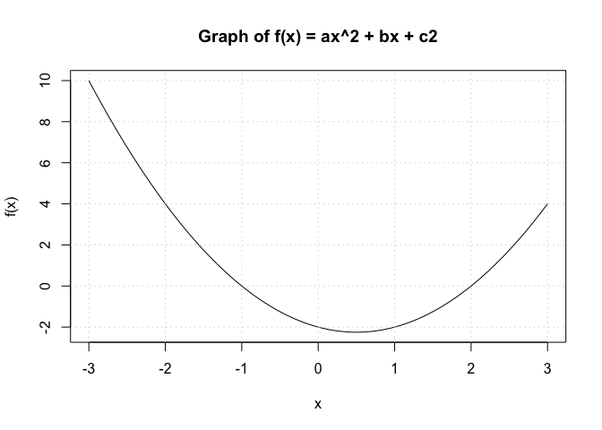
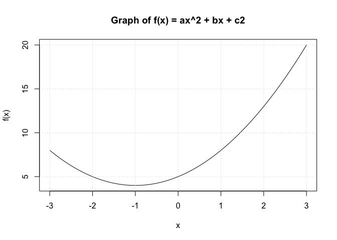
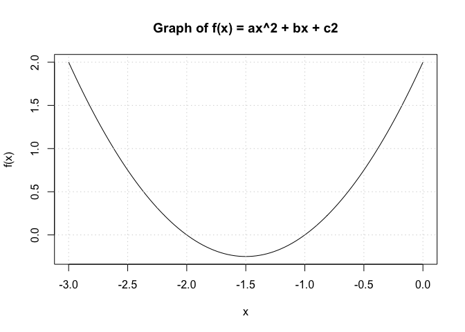

Problem Set 1
================
Nico Hawley-Weld
1/27/24

# Problem 1

Define variables *a* = 1, *b* =  − 1, *c* =  − 2 and print out the
solutions to *f*(*x*) = *a**x*<sup>2</sup> + *b**x* + *c* = 0. Do not
report complex solutions, only real numbers. Avoid using the variable
name `c` as it is a reserved function in R. Show the code and the
answer.

``` r
# Define function to solve for a, b, and c2
solve_quadratic <- function(a, b, c2) {
    # Calculate discriminant
    discriminant <- b^2 - 4*a*c2

    # Check if the discriminant is non-negative
    if (discriminant >= 0) {
        # Calculate the two real solutions
        x1 <- (-b + sqrt(discriminant)) / (2*a)
        x2 <- (-b - sqrt(discriminant)) / (2*a)

        # Print the solutions
        cat("The solutions are:", x1, "and", x2, "\n")
    } else {
        cat("There are no real solutions.\n")
    }
}

# Solve for a=1, b=-1, c=-2
solve_quadratic(1,-1,-2)
```

    The solutions are: 2 and -1 

# Problem 2

Show a graph of *f*(*x*) versus *x* for *x* ∈ (−3,3). Do not show the
code, only the graph.



# Problem 3

Generate a PDF report.

# Problem 4

Erase the PDF report and reproduce it but this time using *a* = 1,
*b* = 2, *c* = 5.

    There are no real solutions.



# Problem 5

Erase the PDF report and reproduce it but this time using *a* = 1,
*b* = 3, *c* = 2. Change the range of `x` to range that clearly shows
the roots.

    The solutions are: -1 and -2 



# Problem 6

Create a markdown page with the results for this last set of values, but
this time showing the code.

``` r
# Solve for and plot a=1, b=3, c=2
solve_quadratic(1,3,2)
```

    The solutions are: -1 and -2 

``` r
plot_quadratic(1,3,2,-3,0)
```


# Problem 7

Submit the markdown page, including all necessary auxiliary files, and
quarto file to a GitHub repo. Make sure the markdown document renders.
