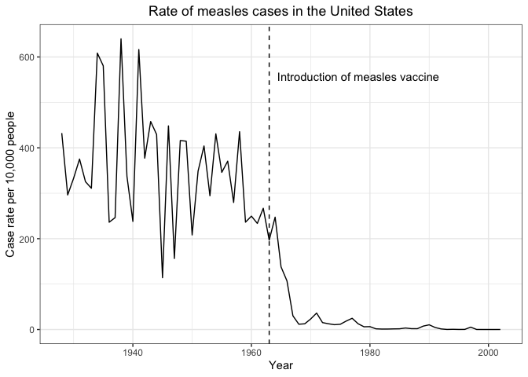
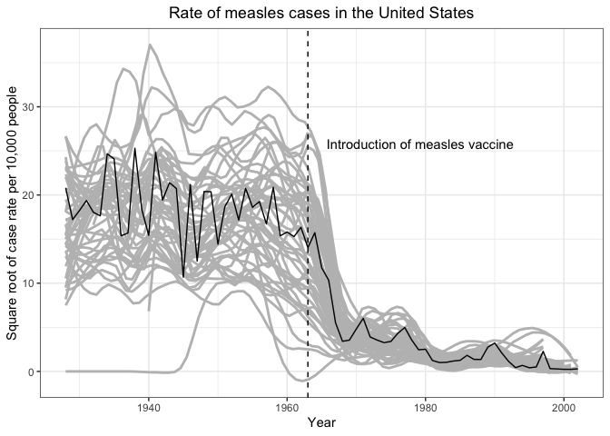
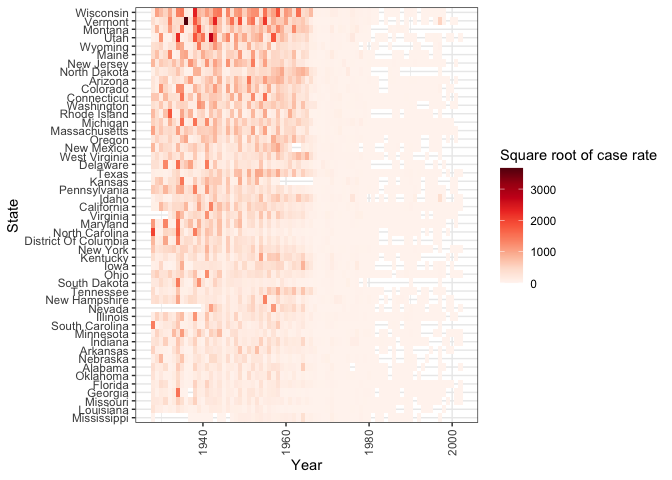

Problem Set 2
================
Nico Hawley-Weld
2/3/24

# Problem 1

Load the `dslabs` package and figure out what is in the
`us_contagious_diseases` dataset. Create a data frame, call it avg, that
has a column for year, and a rate column containing the cases of Measles
per 10,000 people per year in the US. Because we start in 1928, exclude
Alaska and Hawaii. Make sure to take into account the number of weeks
reported each year. If a week was not reported, it should not be
included in the calculation of the rate.

``` r
# Load packages
suppressMessages(library(tidyverse))
suppressMessages(library(dslabs))
```

``` r
# Display all diseases in the data set
disease_levels <- us_contagious_diseases |> 
  pull(disease) |>
  levels()
print(disease_levels)
```

    [1] "Hepatitis A" "Measles"     "Mumps"       "Pertussis"   "Polio"      
    [6] "Rubella"     "Smallpox"   

``` r
# Filter to measles, excluding Alaska and Hawaii, summarizing rate by year
avg <- us_contagious_diseases |>
  filter(disease == "Measles" &
         !state %in% c("Alaska","Hawaii") &
         weeks_reporting > 0) |>
  # mutate(rate = count / (population / 10^5) * (52 / weeks_reporting)) |>
  group_by(year) |>
  summarize(rate = sum(count * 52 / weeks_reporting, na.rm=TRUE) / sum(population / 10^5, na.rm=TRUE))
head(avg)
```

    # A tibble: 6 × 2
       year  rate
      <dbl> <dbl>
    1  1928  432.
    2  1929  296.
    3  1930  333.
    4  1931  375.
    5  1932  325.
    6  1933  311.

# Problem 2

Use the data frame avg to make a trend plot showing the cases rate for
Measles per year. Add a vertical line showing the year the Measles
vaccines was introduced.

``` r
# Plot rate vs year
avg |> 
  ggplot(aes(year, rate)) +
    geom_line() +
    geom_vline(xintercept = 1963, linetype = "dashed") +
    labs(x="Year", y="Case rate per 10,000 people", title="Rate of measles cases in the United States") +
    annotate("text", x = 1963, y = max(avg$rate), label = "Introduction of measles vaccine", vjust = 5, hjust = -0.05) +
    theme_bw() +
    theme(plot.title = element_text(hjust = 0.5))
```



# Problem 3

Add a grey trend line for each state to the plot above. Use a
transformation that keeps the high rates from dominating the figure.

``` r
# Update data frame to include case rates by year and state
avg_by_state <- us_contagious_diseases |>
  filter(disease == "Measles" &
         !state %in% c("Alaska", "Hawaii") &
         weeks_reporting > 0) |>
  group_by(year, state) |>
  summarize(rate = sum(count * 52 / weeks_reporting, na.rm = TRUE) / sum(population / 10^5, na.rm = TRUE), .groups = 'drop')

# Take square root of case rate and add state trend lines as layer to plot
ggplot() + 
    geom_smooth(data = avg_by_state, aes(year, sqrt(rate), group = state), method = "loess", formula = y ~ x, se = FALSE, color = "grey", span = 0.2) +
    geom_line(data = avg, aes(year, sqrt(rate))) + 
    geom_vline(xintercept = 1963, linetype = "dashed") +
    labs(x="Year", y="Square root of case rate per 10,000 people", title="Rate of measles cases in the United States") +
    annotate("text", x = 1963, y = sqrt(max(avg$rate)), label = "Introduction of measles vaccine", vjust = 0, hjust = -0.1) +
    theme_bw() +
    theme(plot.title = element_text(hjust = 0.5))
```



# Problem 4

In the plot above we can’t tell which state is which curve. Using color
would be challenging as it is hard if not impossible to find 48 colors
humans can distinguish. To make a plot where you can compare states
knowing which is which, use one of the axis for state and the other for
year, and then use hue or intensity as a visual cue for rates. Use a
sqrt transformation to avoid the higher rates taking up all the color
scale. Use grey to denote missing data. Order the states based on their
highest peak. You can include Hawaii and Alaska.

``` r
# Use this color palette
reds <- RColorBrewer::brewer.pal(9, "Reds")

# Calculate average rate per state
state_averages <- avg_by_state |>
  group_by(state) |>
  summarize(average_rate = mean(rate, na.rm = TRUE), .groups = 'drop')

# Reorder the state factor in avg_by_state based on the average rate
avg_by_state$state <- factor(avg_by_state$state, levels = state_averages$state[order(state_averages$average_rate)])

# Create heatmap
avg_by_state |> ggplot(aes(x = year, y = state, fill = rate)) +
  geom_tile() +
  scale_fill_gradientn(colors = reds) +
  labs(x = "Year", y = "State", fill = "Square root of case rate") +
  theme_bw() +
  theme(axis.text.x = element_text(angle = 90, vjust = 0.5, hjust = 1))
```


