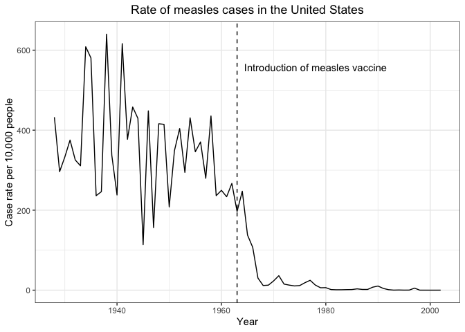
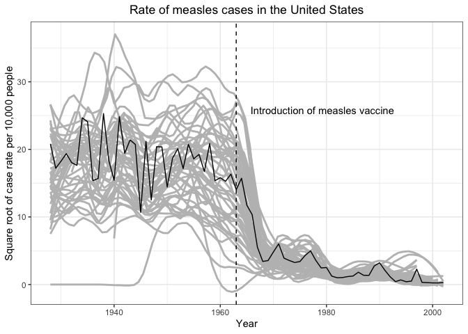
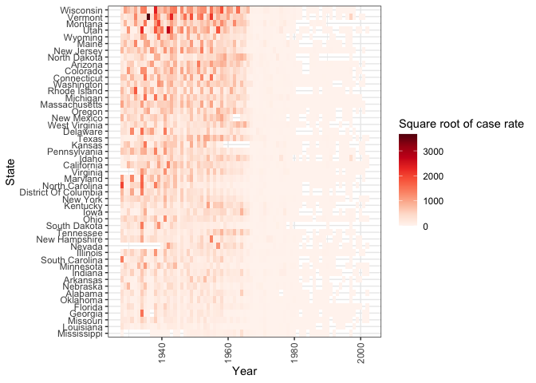

Vaccines Report
================
Nico Hawley-Weld
2/3/24

The measles vaccine was released in 1963. The chart below shows case
rates averaged across all 50 states except for Hawaii and Alaska, dating
back to 1928. The `dslabs` data set shows case rate data for the
following diseases.

    [1] "Hepatitis A" "Measles"     "Mumps"       "Pertussis"   "Polio"      
    [6] "Rubella"     "Smallpox"   

We choose to explore measles. Here is the case rate data averaged across
the U.S. by year, showing the first 10 years.

| Year | U.S. Case Rate Per 10,000 People |
|-----:|---------------------------------:|
| 1928 |                              432 |
| 1929 |                              296 |
| 1930 |                              333 |
| 1931 |                              375 |
| 1932 |                              325 |
| 1933 |                              311 |
| 1934 |                              609 |
| 1935 |                              581 |
| 1936 |                              236 |
| 1937 |                              246 |

Here we can clearly see a reduction in case rate following the year the
measles vaccine was introduced.

It is helpful to see the state by state trendlines in aggregate.

A heatmap helps visualize the case rate data by state and year.

It is evident from the data above that the introduction of the measles
vaccine directly precedes reduced rates of measles in the United States.
For states with high levels of measles before 1963, the drop off can be
visualized with the heat map.
