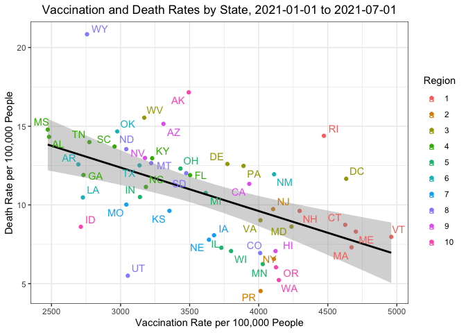

Problem Set 3
================
Nico Hawley-Weld
2/13/24

1.  Get an API key from the US Census at
    <https://api.census.gov/data/key_signup.html>. Save it an object
    called `census_key`.

``` r
# Define census key variable as census_key
source("census_key.R")
```

1.  Use an internet search to find information about the US Census APIs
    to obtain vintage population estimates. Define a variable called
    `api` with the URL.

``` r
api <- "https://api.census.gov/data/2021/pep/population"
```

1.  Read the documentation for the API and use the **httr2** package to
    prepare a request that gives us 2020 and 2021 population estimates
    for each state. Save the request in a variable called `request`,
    without performing it. Compare the request to the examples in the
    documentation to see if you are on the right track.

``` r
suppressMessages(library(httr2))
request <- request(api) |>
  req_url_query(get = I("POP_2020,POP_2021,NAME"),
                `for` = I("state:*"),
                key = census_key)
```

1.  Now perform the request and examine the data that is returned. Save
    the result to `request` (overwrite it).

``` r
request <- req_perform(request)
```

1.  We see the request returned data in JSON format. We can see the
    content with the function `req_body_json`, but we want a data frame.
    Use the **jsonlite** package to convert the raw JSON data into a
    data frame. Save it in `population`.

``` r
suppressMessages(library(jsonlite))
population <- request |>
  resp_body_string() |>
  fromJSON(flatten = TRUE)
```

1.  Examine the table. Notice 1) it is not tidy, 2) the column types are
    not what we want, and 3) the first row is a header. Convert
    `population` to a tidy dataset. Remove the state ID column and
    change the name of the column with state names to `state_name`. Add
    a column with state abbreviations called `state`. Make sure you
    assign the abbreviations for DC and PR correctly. Hint: Start by
    using the **janitor** package to make the first row the header.

``` r
suppressMessages(library(tidyverse))
suppressMessages(library(janitor))
population <- population |>
  row_to_names(1) |>
  as_tibble() |>
  select(-state) |>
  rename(state_name = NAME) |>
  pivot_longer(-state_name, names_to = "year", values_to = "population") |>
  mutate(year = str_remove(year, "POP_")) |>
  mutate(across(-state_name, as.numeric)) |>
  mutate(state = case_when(
    state_name == "District of Columbia" ~ "DC",
    state_name == "Puerto Rico" ~ "PR",
    TRUE ~ state.abb[match(state_name, state.name)]
  ))
```

1.  As a check, make a barplot of states’ 2021 populations

``` r
population |> 
  filter(year == 2021) |>
  ggplot(aes(x = reorder(state, population), y = population)) +
    geom_bar(stat = "identity", fill = "grey", color = "black") +
    coord_flip() +
    labs(title = "2021 U.S. State Populations",
         x = "State",
         y = "Population") +
    theme_bw() +
    theme(axis.text.y = element_text(size = 6),
          panel.grid.major = element_blank(),
          panel.grid.minor = element_blank()) +
    theme(plot.title = element_text(hjust = 0.5))
```


1.  To practice `pivot_wider` make a bar plot of percent change in
    population by state.

``` r
population |>
  pivot_wider(names_from = year, values_from = population) |>
  mutate(percent_change = ((`2021` - `2020`) / `2020`) * 100) |>
    ggplot(aes(x = reorder(state, percent_change), y = percent_change)) +
    geom_bar(stat = "identity", fill = "grey", color = "black") +
    coord_flip() +
    labs(title = "Percent Change in U.S. State Populations from 2020 to 2021",
         x = "State",
         y = "Percent Change in Population from 2020 to 2021") +
    theme_bw() +
    theme(axis.text.y = element_text(size = 6),
          panel.grid.major = element_blank(),
          panel.grid.minor = element_blank()) +
    theme(plot.title = element_text(hjust = 0.5))
```


1.  Add the following region numbers to the data:

``` r
cdc_regions_list <- list(
  "1" = c("Connecticut", "Maine", "Massachusetts", "New Hampshire", "Rhode Island", "Vermont"),
  "2" = c("New Jersey", "New York", "Puerto Rico", "Virgin Islands"),
  "3" = c("Delaware", "District of Columbia", "Maryland", "Pennsylvania", "Virginia", "West Virginia"),
  "4" = c("Alabama", "Florida", "Georgia", "Kentucky", "Mississippi", "North Carolina", "South Carolina", "Tennessee"),
  "5" = c("Illinois", "Indiana", "Michigan", "Minnesota", "Ohio", "Wisconsin"),
  "6" = c("Arkansas", "Louisiana", "New Mexico", "Oklahoma", "Texas"),
  "7" = c("Iowa", "Kansas", "Missouri", "Nebraska"),
  "8" = c("Colorado", "Montana", "North Dakota", "South Dakota", "Utah", "Wyoming"),
  "9" = c("Arizona", "California", "Hawaii", "Nevada", "American Samoa", "Commonwealth of the Northern Mariana Islands", "Federated States of Micronesia", "Guam", "Marshall Islands", "Republic of Palau"),
  "10" = c("Alaska", "Idaho", "Oregon", "Washington"))

cdc_regions <- do.call(rbind, lapply(names(cdc_regions_list), function(region) {
  data.frame(region = region, state_name = cdc_regions_list[[region]])
})) |>
  mutate(region = factor(as.numeric(region)))

population <- population |>
  left_join(cdc_regions, by = c("state_name"))
```

1.  Go to <https://data.cdc.gov/> and learn about the CDC API for
    COVID-19 data. Find an API that provides state level data from
    SARS-COV2 cases and store it in a data frame.

``` r
about_page <- "https://data.cdc.gov/Case-Surveillance/Weekly-United-States-COVID-19-Cases-and-Deaths-by-/pwn4-m3yp/about_data"
api <- "https://data.cdc.gov/resource/pwn4-m3yp.json"
cases_raw <- request(api) |>
  req_url_query("$limit" = 100000) |>
  req_perform() |>
  resp_body_string() |>
  fromJSON(flatten = TRUE)
head(cases_raw)
```

                 date_updated state              start_date                end_date
    1 2023-02-23T00:00:00.000    AZ 2023-02-16T00:00:00.000 2023-02-22T00:00:00.000
    2 2022-12-22T00:00:00.000    LA 2022-12-15T00:00:00.000 2022-12-21T00:00:00.000
    3 2023-02-23T00:00:00.000    GA 2023-02-16T00:00:00.000 2023-02-22T00:00:00.000
    4 2023-03-30T00:00:00.000    LA 2023-03-23T00:00:00.000 2023-03-29T00:00:00.000
    5 2023-02-02T00:00:00.000    LA 2023-01-26T00:00:00.000 2023-02-01T00:00:00.000
    6 2023-03-23T00:00:00.000    LA 2023-03-16T00:00:00.000 2023-03-22T00:00:00.000
      tot_cases new_cases tot_deaths new_deaths new_historic_cases
    1 2434631.0    3716.0    33042.0       39.0              23150
    2 1507707.0    4041.0    18345.0       21.0              21397
    3 3061141.0    5298.0    42324.0       88.0               6800
    4 1588259.0    2203.0    18858.0       23.0               5347
    5 1548508.0    5725.0    18572.0       47.0               4507
    6 1580709.0    1961.0    18835.0       35.0               2239
      new_historic_deaths
    1                   0
    2                   0
    3                   0
    4                   0
    5                   0
    6                   0

1.  Note that we obtained weekly data. Wrangle the table so that you
    keep only states for which you have population data. Keep the
    following variables: state, epidemiological week and year, and new
    cases (as numbers). Order by state, then chronologically. Hint: Use
    `as_date`, `epiweek` and `epiyear` functions in **lubridate**
    package.

``` r
library(lubridate)
cases <- cases_raw |>
  as_tibble() |>
  filter(state %in% population$state) |>
  mutate(start_date = ymd_hms(start_date)) |>
  mutate(epi_week = epiweek(start_date),
         epi_year = epiyear(start_date)) |>
  select(state, epi_year, epi_week, new_cases) |>
  filter(!is.na(state), !is.na(new_cases)) |>
  mutate(new_cases = round(as.numeric(new_cases))) |>
  group_by(state, epi_year, epi_week, .groups = "drop") |>
  summarize(new_cases = sum(new_cases)) |>
  ungroup () |>
  select(-.groups) |>
  arrange(state, epi_year, epi_week) |>
  suppressMessages()
head(cases)
```

    # A tibble: 6 × 4
      state epi_year epi_week new_cases
      <chr>    <dbl>    <dbl>     <dbl>
    1 AK        2020        3         0
    2 AK        2020        4         0
    3 AK        2020        5         0
    4 AK        2020        6         0
    5 AK        2020        7         0
    6 AK        2020        8         0

1.  Now repeat the same exercise for hospitalizations. However, before
    you start, notice the code for extracting the data is the same as in
    the previous exercise except for the API URL. Write a function that
    takes an API URL and returns the data in a data frame.

``` r
get_cdc_data <- function(api){
  request(api) |>
    req_url_query("$limit" = 10000000) |>
    req_perform() |>
    resp_body_string() |>
    fromJSON(flatten = TRUE)
}
```

1.  Now use the function to get the raw hospital data. Examine the data
    once you have it to determine if it is daily or weekly.

``` r
about <- "https://healthdata.gov/dataset/United-States-COVID-19-Hospitalization-Metrics-by-/n2qh-gzpn/about_data"
api <- "https://data.cdc.gov/resource/39z2-9zu6.json"
hosp_raw <- get_cdc_data(api)
```

1.  Collapse the data into weekly data and keep the same columns as in
    the cases dataset, except keep total weekly hospitalizations instead
    of cases. Remove weeks with less than 7 days reporting.

``` r
hosp <- hosp_raw |>
  filter(jurisdiction %in% population$state) |>
  mutate(collection_date = ymd_hms(collection_date)) |>
  mutate(epi_week = epiweek(collection_date),
         epi_year = epiyear(collection_date)) |>
  mutate(state = jurisdiction) |>
  mutate(new_hospitalizations = new_covid_19_hospital) |>
  select(state, epi_year, epi_week, new_hospitalizations) |>
  filter(!is.na(state), !is.na(new_hospitalizations)) |>
  group_by(state, epi_year, epi_week) |> # group to remove weeks with fewer than 7 reports
  filter(n() >= 7) |>
  ungroup() |>
  mutate(new_hospitalizations = as.numeric(new_hospitalizations)) |>
  group_by(state, epi_year, epi_week, .groups = "drop") |>
  summarize(new_hospitalizations = sum(new_hospitalizations)) |>
  ungroup () |>
  select(-.groups) |>
  arrange(state, epi_year, epi_week) |>
  suppressMessages()
head(hosp)
```

    # A tibble: 6 × 4
      state epi_year epi_week new_hospitalizations
      <chr>    <dbl>    <dbl>                <dbl>
    1 AK        2020       32                   28
    2 AK        2020       33                   22
    3 AK        2020       34                   31
    4 AK        2020       35                   31
    5 AK        2020       36                   35
    6 AK        2020       37                   30

1.  Repeat what you did in the previous two exercises for provisional
    COVID-19 deaths.

``` r
about <- "https://data.cdc.gov/NCHS/Provisional-COVID-19-Death-Counts-by-Week-Ending-D/r8kw-7aab/about_data"
api <- "https://data.cdc.gov/resource/r8kw-7aab.json"
deaths_raw <- get_cdc_data(api)
deaths <- deaths_raw |>
  as_tibble() |>
  mutate(state = case_when(
    state == "District of Columbia" ~ "DC",
    state == "Puerto Rico" ~ "PR",
    TRUE ~ state.abb[match(state, state.name)]
    )) |>
  filter(state %in% population$state) |>
  mutate(start_date = ymd_hms(start_date)) |>
  mutate(epi_week = epiweek(start_date),
         epi_year = epiyear(start_date)) |>
  select(state, epi_year, epi_week, covid_19_deaths) |>
  filter(!is.na(state), !is.na(covid_19_deaths)) |>
  mutate(covid_19_deaths = as.numeric(covid_19_deaths)) |>
  group_by(state, epi_year, epi_week, .groups = "drop") |>
  summarize(covid_19_deaths = sum(covid_19_deaths)) |>
  ungroup () |>
  select(-.groups) |>
  arrange(state, epi_year, epi_week) |>
  suppressMessages()
head(deaths)
```

    # A tibble: 6 × 4
      state epi_year epi_week covid_19_deaths
      <chr>    <dbl>    <dbl>           <dbl>
    1 AK        2020        1            1782
    2 AK        2020        2               0
    3 AK        2020        3               0
    4 AK        2020        4               0
    5 AK        2020        5               0
    6 AK        2020        6               0

1.  Obtain vaccination data. Keep the variables `series_complete` and
    `booster` along with state and date. Remember we will later want to
    join with the others.

``` r
about <- "https://catalog.data.gov/dataset/covid-19-vaccination-trends-in-the-united-statesnational-80d4f"
api <- "https://data.cdc.gov/resource/rh2h-3yt2.json"
vax_raw <- get_cdc_data(api)
vax <- vax_raw |> 
  as_tibble() |>
  filter(location %in% population$state) |>
  mutate(state = location) |>
  mutate(date = ymd_hms(date)) |>
  mutate(epi_week = epiweek(date),
         epi_year = epiyear(date)) |>
  select(state, epi_year, epi_week, administered_daily, series_complete_daily, booster_daily) |>
  filter(!is.na(state)) |>
  mutate(administered_daily = as.numeric(administered_daily),
         series_complete_daily = as.numeric(series_complete_daily),
         booster_daily = as.numeric(booster_daily)) |>
  group_by(state, epi_year, epi_week, .groups = "drop") |>
  summarize(administered_daily = sum(administered_daily),
            series_complete_daily = sum(series_complete_daily),
            booster_daily = sum(booster_daily)) |>
  ungroup() |>
  select(-.groups) |>
  arrange(state, epi_year, epi_week) |>
  suppressMessages()
head(vax)
```

    # A tibble: 6 × 6
      state epi_year epi_week administered_daily series_complete_daily booster_daily
      <chr>    <dbl>    <dbl>              <dbl>                 <dbl>         <dbl>
    1 AK        2020       51               9610                    46             0
    2 AK        2020       52              17131                    23             0
    3 AK        2020       53              15928                    45             0
    4 AK        2021        1              35664                  8282             0
    5 AK        2021        2              65829                  5164             0
    6 AK        2021        3              62525                  6551             0

1.  Now we are ready to join the tables. We will only consider 2020 and
    2021 as we don’t have population sizes for 2022 onwards. However,
    because we want to guarantee that all dates are included we will
    create a data frame with all possible weeks. We can use this:

``` r
all_dates <- data.frame(date = seq(make_date(2020, 1, 25), make_date(2021, 12, 31), by = "week")) |>
  mutate(date = ceiling_date(date, unit = "week", week_start = 7) - days(1)) |>
  mutate(epi_year = epiyear(date), epi_week = epiweek(date)) 
# dates_and_pop <- cross_join(population, all_dates)
# match dates to population
dates_and_pop <- bind_rows(
  population |>
    filter(year == 2020) |>
    cross_join(all_dates |>
                 filter(epi_year == 2020)),
  population |>
    filter(year == 2021) |>
    cross_join(all_dates |>
                 filter(epi_year == 2021))
)
```

Use this to join all the tables in a way that preserves these dates.
Call the final table `dat`.

``` r
dat <- reduce(list(dates_and_pop, cases, hosp, vax, deaths),
              left_join,
              by = c("state", "epi_year", "epi_week")
)
head(dat)
```

    # A tibble: 6 × 14
      state_name  year population state region date       epi_year epi_week
      <chr>      <dbl>      <dbl> <chr> <fct>  <date>        <dbl>    <dbl>
    1 Oklahoma    2020    3962031 OK    6      2020-01-25     2020        4
    2 Oklahoma    2020    3962031 OK    6      2020-02-01     2020        5
    3 Oklahoma    2020    3962031 OK    6      2020-02-08     2020        6
    4 Oklahoma    2020    3962031 OK    6      2020-02-15     2020        7
    5 Oklahoma    2020    3962031 OK    6      2020-02-22     2020        8
    6 Oklahoma    2020    3962031 OK    6      2020-02-29     2020        9
    # ℹ 6 more variables: new_cases <dbl>, new_hospitalizations <dbl>,
    #   administered_daily <dbl>, series_complete_daily <dbl>, booster_daily <dbl>,
    #   covid_19_deaths <dbl>

1.  Plot a trend plot with cases per person for all states with color
    representing region.

``` r
dat |> mutate(cases_per_person = new_cases / population) |>
  ggplot(aes(x = date, y = cases_per_person, color = region)) +
  geom_line() +
  labs(x = "Date",
       y = "Cases per Person",
       color = "Region",
       title = "COVID-19 Cases per Person by State") +
  theme_bw() +
  theme(plot.title = element_text(hjust = 0.5))
```


1.  Repeat the above for hospitalizations and deaths. Use `pivot_longer`
    and `facet_wrap`. Plot rates per 100, 000 people. Place the plots on
    top of each other.

``` r
dat |>
  mutate(case_rate = new_cases / population * 100000,
         hospitalization_rate = new_hospitalizations / population * 100000,
         death_rate = covid_19_deaths / population * 100000) |>
  pivot_longer(cols = c(case_rate, hospitalization_rate, death_rate),
               names_to = "variable",
               values_to = "rate_per_person") |>
  ggplot(aes(x = date, y = rate_per_person, color = region)) +
  geom_line() +
  facet_wrap(~ variable, nrow = 3, scales = "free_y") +
  labs(x = "Date",
       y = "Rate per 100,000 Persons",
       color = "Region",
       title = "COVID-19 Cases, Hospitalizations, and Deaths Per 100,000 Persons by State") +
  theme_bw() +
  theme(plot.title = element_text(hjust = 0.5))
```


1.  For the period January 1 to July 1, 2021 compute the deaths per day
    per 100,000 people in each state as well as the vaccination rate
    (primary series) by September 1st. Plot these against each other.

``` r
library(ggrepel)
dat |>
  filter(date >= ymd("2021-01-01") & date <= ymd("2021-07-01")) |>
  mutate(vax_rate = series_complete_daily / population * 100000,
         death_rate = covid_19_deaths / population * 100000) |>
  group_by(state, region) |>
  summarize(mean_vax_rate = mean(vax_rate, na.rm = TRUE),
            mean_death_rate = mean(death_rate, na.rm = TRUE)) |>
  suppressMessages() |>
  ggplot(aes(x = mean_vax_rate, y = mean_death_rate)) +
  geom_point(aes(color = region)) +
  geom_smooth(formula = y ~ x, method = "lm", se = TRUE, color = "black") +
  geom_text_repel(aes(label = state, color = region)) +
  labs(x = "Vaccination Rate per 100,000 People",
       y = "Death Rate per 100,000 People",
       color = "Region",
       title = "Vaccination and Death Rates by State, 2021-01-01 to 2021-07-01") +
  theme_bw() +
  theme(plot.title = element_text(hjust = 0.5))
```



1.  Repeat the exercise for the booster for October 1 to December 31,
    2021.

``` r
dat |>
  filter(date >= ymd("2021-10-01") & date <= ymd("2021-12-31")) |>
  mutate(booster_rate = booster_daily / population * 100000,
         death_rate = covid_19_deaths / population * 100000) |>
  group_by(state, region) |>
  summarize(mean_booster_rate = mean(booster_rate, na.rm = TRUE),
            mean_death_rate = mean(death_rate, na.rm = TRUE)) |>
  suppressMessages() |>
  ggplot(aes(x = mean_booster_rate, y = mean_death_rate)) +
  geom_point(aes(color = region)) +
  geom_smooth(formula = y ~ x, method = "lm", se = TRUE, color = "black") +
  geom_text_repel(aes(label = state, color = region)) +
  labs(x = "Booster Rate per 100,000 People",
       y = "Death Rate per 100,000 People",
       color = "Region",
       title = "Booster and Death Rates by State, 2021-10-01 to 2021-12-31") +
  theme_bw() +
  theme(plot.title = element_text(hjust = 0.5))
```


