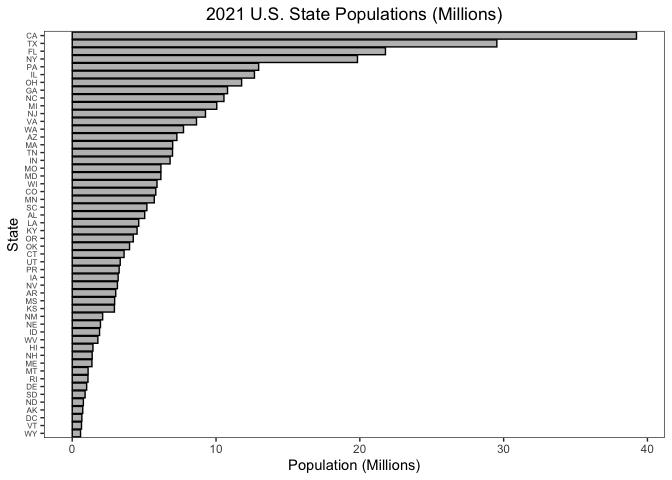
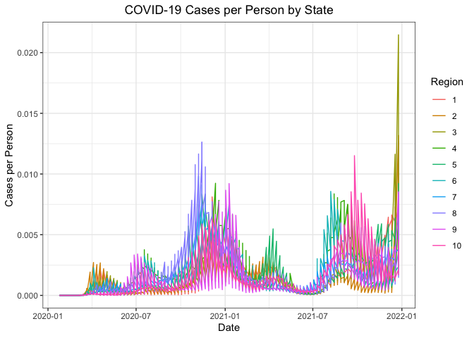
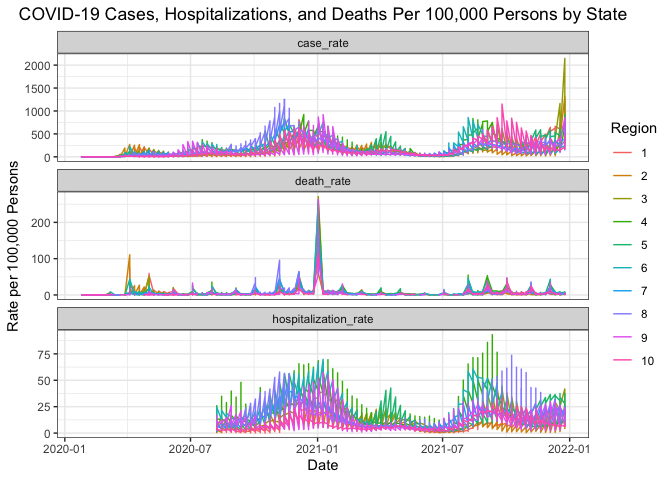
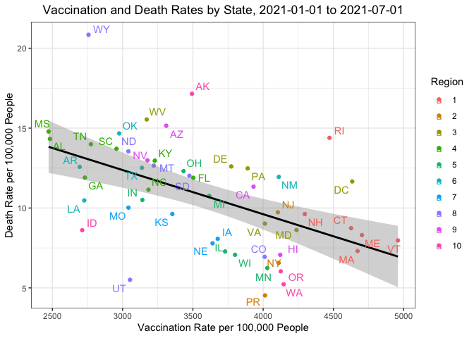
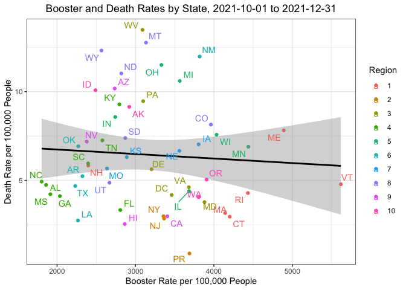

Problem Set 3 Guide
================
Nico Hawley-Weld
2/13/24

The following is a guide to extracting population data from the US
Census and COVID-19 case, hospitalization, vaccination, and death rates
from the CDC.

# US Census API

First, for the US Census, an API key and URL must be defined.

``` r
source("census_key.R")
api <- "https://api.census.gov/data/2021/pep/population"
```

We use the **httr2** package to request 2020 and 2021 population
estimates for each state.

``` r
suppressMessages(library(httr2))
request <- request(api) |>
  req_url_query(get = I("POP_2020,POP_2021,NAME"),
                `for` = I("state:*"),
                key = census_key) |>
  req_perform()
```

Now, we use the **jsonlite** package to convert the raw JSON data into a
data frame.

``` r
suppressMessages(library(jsonlite))
population_raw <- request |>
  resp_body_string() |>
  fromJSON(flatten = TRUE)
head(population_raw)
```

         [,1]       [,2]       [,3]           [,4]   
    [1,] "POP_2020" "POP_2021" "NAME"         "state"
    [2,] "3962031"  "3986639"  "Oklahoma"     "40"   
    [3,] "1961455"  "1963692"  "Nebraska"     "31"   
    [4,] "1451911"  "1441553"  "Hawaii"       "15"   
    [5,] "887099"   "895376"   "South Dakota" "46"   
    [6,] "6920119"  "6975218"  "Tennessee"    "47"   

We clean up the raw population data into tidy format. Using **dplyr**
and **janitor** with the pipe operator `|>` simplifies the process with
incredibly readable code.

``` r
suppressMessages(library(tidyverse))
suppressMessages(library(janitor))
population <- population_raw |>
  row_to_names(1) |>
  as_tibble() |>
  select(-state) |>
  rename(state_name = NAME) |>
  pivot_longer(-state_name, names_to = "year", values_to = "population") |>
  mutate(year = str_remove(year, "POP_")) |>
  mutate(across(-state_name, as.numeric)) |>
  mutate(state = case_when(
    state_name == "District of Columbia" ~ "DC",
    state_name == "Puerto Rico" ~ "PR",
    TRUE ~ state.abb[match(state_name, state.name)]
  ))
head(population)
```

    # A tibble: 6 × 4
      state_name  year population state
      <chr>      <dbl>      <dbl> <chr>
    1 Oklahoma    2020    3962031 OK   
    2 Oklahoma    2021    3986639 OK   
    3 Nebraska    2020    1961455 NE   
    4 Nebraska    2021    1963692 NE   
    5 Hawaii      2020    1451911 HI   
    6 Hawaii      2021    1441553 HI   

As a check, we make a barplot of states’ 2021 populations.

``` r
population |> 
  filter(year == 2021) |>
  ggplot(aes(x = reorder(state, population / 1000000), y = population / 1000000)) +
    geom_bar(stat = "identity", fill = "grey", color = "black") +
    coord_flip() +
    labs(title = "2021 U.S. State Populations (Millions)",
         x = "State",
         y = "Population (Millions)") +
    theme_bw() +
    theme(axis.text.y = element_text(size = 6),
          panel.grid.major = element_blank(),
          panel.grid.minor = element_blank()) +
    theme(plot.title = element_text(hjust = 0.5))
```



Now we add region numbers to the data.

``` r
cdc_regions_list <- list(
  "1" = c("Connecticut", "Maine", "Massachusetts", "New Hampshire", "Rhode Island", "Vermont"),
  "2" = c("New Jersey", "New York", "Puerto Rico", "Virgin Islands"),
  "3" = c("Delaware", "District of Columbia", "Maryland", "Pennsylvania", "Virginia", "West Virginia"),
  "4" = c("Alabama", "Florida", "Georgia", "Kentucky", "Mississippi", "North Carolina", "South Carolina", "Tennessee"),
  "5" = c("Illinois", "Indiana", "Michigan", "Minnesota", "Ohio", "Wisconsin"),
  "6" = c("Arkansas", "Louisiana", "New Mexico", "Oklahoma", "Texas"),
  "7" = c("Iowa", "Kansas", "Missouri", "Nebraska"),
  "8" = c("Colorado", "Montana", "North Dakota", "South Dakota", "Utah", "Wyoming"),
  "9" = c("Arizona", "California", "Hawaii", "Nevada", "American Samoa", "Commonwealth of the Northern Mariana Islands", "Federated States of Micronesia", "Guam", "Marshall Islands", "Republic of Palau"),
  "10" = c("Alaska", "Idaho", "Oregon", "Washington"))

cdc_regions <- do.call(rbind, lapply(names(cdc_regions_list), function(region) {
  data.frame(region = region, state_name = cdc_regions_list[[region]])
})) |>
  mutate(region = factor(as.numeric(region)))

population <- population |>
  left_join(cdc_regions, by = c("state_name"))
head(population)
```

    # A tibble: 6 × 5
      state_name  year population state region
      <chr>      <dbl>      <dbl> <chr> <fct> 
    1 Oklahoma    2020    3962031 OK    6     
    2 Oklahoma    2021    3986639 OK    6     
    3 Nebraska    2020    1961455 NE    7     
    4 Nebraska    2021    1963692 NE    7     
    5 Hawaii      2020    1451911 HI    9     
    6 Hawaii      2021    1441553 HI    9     

# CDC APIs

We will explore four datasets from the CDC: COVID-19 case,
hospitalization, vaccination, and death rates by state. We define a
function to extract CDC data from a generic API URL.

``` r
get_cdc_data <- function(api){
  request(api) |>
    req_url_query("$limit" = 10000000) |>
    req_perform() |>
    resp_body_string() |>
    fromJSON(flatten = TRUE)
}
```

First, we retrieve and wrangle data on case rates.

``` r
# Retrieve case rate data
about_page <- "https://data.cdc.gov/Case-Surveillance/Weekly-United-States-COVID-19-Cases-and-Deaths-by-/pwn4-m3yp/about_data"
api <- "https://data.cdc.gov/resource/pwn4-m3yp.json"
cases_raw <- get_cdc_data(api)

# Wrangle relevant elements into tidy format
library(lubridate)
cases <- cases_raw |>
  as_tibble() |>
  filter(state %in% population$state) |>
  mutate(start_date = ymd_hms(start_date)) |>
  mutate(epi_week = epiweek(start_date),
         epi_year = epiyear(start_date)) |>
  select(state, epi_year, epi_week, new_cases) |>
  filter(!is.na(state), !is.na(new_cases)) |>
  mutate(new_cases = round(as.numeric(new_cases))) |>
  group_by(state, epi_year, epi_week, .groups = "drop") |>
  summarize(new_cases = sum(new_cases)) |>
  ungroup () |>
  select(-.groups) |>
  arrange(state, epi_year, epi_week) |>
  suppressMessages()
head(cases)
```

    # A tibble: 6 × 4
      state epi_year epi_week new_cases
      <chr>    <dbl>    <dbl>     <dbl>
    1 AK        2020        3         0
    2 AK        2020        4         0
    3 AK        2020        5         0
    4 AK        2020        6         0
    5 AK        2020        7         0
    6 AK        2020        8         0

Now, we repeat for hospitalizations, deaths, and vaccination rates. In
the case of vaccination rates we include daily administrations, series
completions, and booster administrations.

``` r
# Retrieve hospitalization rate data
about <- "https://healthdata.gov/dataset/United-States-COVID-19-Hospitalization-Metrics-by-/n2qh-gzpn/about_data"
api <- "https://data.cdc.gov/resource/39z2-9zu6.json"
hosp_raw <- get_cdc_data(api)

# Wrangle relevant elements into tidy format
hosp <- hosp_raw |>
  filter(jurisdiction %in% population$state) |>
  mutate(collection_date = ymd_hms(collection_date)) |>
  mutate(epi_week = epiweek(collection_date),
         epi_year = epiyear(collection_date)) |>
  mutate(state = jurisdiction) |>
  mutate(new_hospitalizations = new_covid_19_hospital) |>
  select(state, epi_year, epi_week, new_hospitalizations) |>
  filter(!is.na(state), !is.na(new_hospitalizations)) |>
  group_by(state, epi_year, epi_week) |> # group to remove weeks with fewer than 7 reports
  filter(n() >= 7) |>
  ungroup() |>
  mutate(new_hospitalizations = as.numeric(new_hospitalizations)) |>
  group_by(state, epi_year, epi_week, .groups = "drop") |>
  summarize(new_hospitalizations = sum(new_hospitalizations)) |>
  ungroup () |>
  select(-.groups) |>
  arrange(state, epi_year, epi_week) |>
  suppressMessages()
head(hosp)
```

    # A tibble: 6 × 4
      state epi_year epi_week new_hospitalizations
      <chr>    <dbl>    <dbl>                <dbl>
    1 AK        2020       32                   28
    2 AK        2020       33                   22
    3 AK        2020       34                   31
    4 AK        2020       35                   31
    5 AK        2020       36                   35
    6 AK        2020       37                   30

``` r
# Retrieve death rate data
about <- "https://data.cdc.gov/NCHS/Provisional-COVID-19-Death-Counts-by-Week-Ending-D/r8kw-7aab/about_data"
api <- "https://data.cdc.gov/resource/r8kw-7aab.json"
deaths_raw <- get_cdc_data(api)

# Wrangle relevant elements into tidy format
deaths <- deaths_raw |>
  as_tibble() |>
  mutate(state = case_when(
    state == "District of Columbia" ~ "DC",
    state == "Puerto Rico" ~ "PR",
    TRUE ~ state.abb[match(state, state.name)]
    )) |>
  filter(state %in% population$state) |>
  mutate(start_date = ymd_hms(start_date)) |>
  mutate(epi_week = epiweek(start_date),
         epi_year = epiyear(start_date)) |>
  select(state, epi_year, epi_week, covid_19_deaths) |>
  filter(!is.na(state), !is.na(covid_19_deaths)) |>
  mutate(covid_19_deaths = as.numeric(covid_19_deaths)) |>
  group_by(state, epi_year, epi_week, .groups = "drop") |>
  summarize(covid_19_deaths = sum(covid_19_deaths)) |>
  ungroup () |>
  select(-.groups) |>
  arrange(state, epi_year, epi_week) |>
  suppressMessages()
head(deaths)
```

    # A tibble: 6 × 4
      state epi_year epi_week covid_19_deaths
      <chr>    <dbl>    <dbl>           <dbl>
    1 AK        2020        1            1782
    2 AK        2020        2               0
    3 AK        2020        3               0
    4 AK        2020        4               0
    5 AK        2020        5               0
    6 AK        2020        6               0

``` r
# Retrieve vaccination rate data
about <- "https://catalog.data.gov/dataset/covid-19-vaccination-trends-in-the-united-statesnational-80d4f"
api <- "https://data.cdc.gov/resource/rh2h-3yt2.json"
vax_raw <- get_cdc_data(api)

# Wrangle relevant elements into tidy format
vax <- vax_raw |> 
  as_tibble() |>
  filter(location %in% population$state) |>
  mutate(state = location) |>
  mutate(date = ymd_hms(date)) |>
  mutate(epi_week = epiweek(date),
         epi_year = epiyear(date)) |>
  select(state, epi_year, epi_week, administered_daily, series_complete_daily, booster_daily) |>
  filter(!is.na(state)) |>
  mutate(administered_daily = as.numeric(administered_daily),
         series_complete_daily = as.numeric(series_complete_daily),
         booster_daily = as.numeric(booster_daily)) |>
  group_by(state, epi_year, epi_week, .groups = "drop") |>
  summarize(administered_daily = sum(administered_daily),
            series_complete_daily = sum(series_complete_daily),
            booster_daily = sum(booster_daily)) |>
  ungroup() |>
  select(-.groups) |>
  arrange(state, epi_year, epi_week) |>
  suppressMessages()
head(vax)
```

    # A tibble: 6 × 6
      state epi_year epi_week administered_daily series_complete_daily booster_daily
      <chr>    <dbl>    <dbl>              <dbl>                 <dbl>         <dbl>
    1 AK        2020       51               9610                    46             0
    2 AK        2020       52              17131                    23             0
    3 AK        2020       53              15928                    45             0
    4 AK        2021        1              35664                  8282             0
    5 AK        2021        2              65829                  5164             0
    6 AK        2021        3              62525                  6551             0

# Joining the data

We are now interested in joining our five tibbles: `population`,
`cases`, `hosp`, `deaths`, and `vax`. We limit the dates to 2020-01-25
through 2021-12-31, denoting the day of the WHO Situation Report 5
through til the end of the most recent year for which state population
data are available. Before making the joins, we create a new tibble,
`dates_and_pop`, listing each state, epidemiological year, and
epidemiological week combination during the time window of interest. We
start by defining `all_dates`, listing all the weeks of interest. The
key is that we don’t want to `cross_join(population, all_dates)`,
because that would provide two date lists for each state-year. Instead
we filter both `population` and `all_dates` by year.

``` r
all_dates <- data.frame(date = seq(make_date(2020, 1, 25), make_date(2021, 12, 31), by = "week")) |>
  mutate(date = ceiling_date(date, unit = "week", week_start = 7) - days(1)) |>
  mutate(epi_year = epiyear(date), epi_week = epiweek(date)) 
# dates_and_pop <- cross_join(population, all_dates)
# match dates to population
dates_and_pop <- bind_rows(
  population |>
    filter(year == 2020) |>
    cross_join(all_dates |>
                 filter(epi_year == 2020)),
  population |>
    filter(year == 2021) |>
    cross_join(all_dates |>
                 filter(epi_year == 2021))
)
head(dates_and_pop)
```

    # A tibble: 6 × 8
      state_name  year population state region date       epi_year epi_week
      <chr>      <dbl>      <dbl> <chr> <fct>  <date>        <dbl>    <dbl>
    1 Oklahoma    2020    3962031 OK    6      2020-01-25     2020        4
    2 Oklahoma    2020    3962031 OK    6      2020-02-01     2020        5
    3 Oklahoma    2020    3962031 OK    6      2020-02-08     2020        6
    4 Oklahoma    2020    3962031 OK    6      2020-02-15     2020        7
    5 Oklahoma    2020    3962031 OK    6      2020-02-22     2020        8
    6 Oklahoma    2020    3962031 OK    6      2020-02-29     2020        9

To join the tibbles, we are interested in joining `dates_and_pop`,
`cases`, `hosp`, `vax`, `deaths` by the columns `state`, `epi_year`, and
`epi_week`. Instead of running four different `left_join()` functions,
we can specify the joins all at once using the function `reduce()`. We
save the joined and wrangle data in the tibble `dat`.

``` r
dat <- reduce(list(dates_and_pop, cases, hosp, vax, deaths),
              left_join,
              by = c("state", "epi_year", "epi_week")
)
head(dat)
```

    # A tibble: 6 × 14
      state_name  year population state region date       epi_year epi_week
      <chr>      <dbl>      <dbl> <chr> <fct>  <date>        <dbl>    <dbl>
    1 Oklahoma    2020    3962031 OK    6      2020-01-25     2020        4
    2 Oklahoma    2020    3962031 OK    6      2020-02-01     2020        5
    3 Oklahoma    2020    3962031 OK    6      2020-02-08     2020        6
    4 Oklahoma    2020    3962031 OK    6      2020-02-15     2020        7
    5 Oklahoma    2020    3962031 OK    6      2020-02-22     2020        8
    6 Oklahoma    2020    3962031 OK    6      2020-02-29     2020        9
    # ℹ 6 more variables: new_cases <dbl>, new_hospitalizations <dbl>,
    #   administered_daily <dbl>, series_complete_daily <dbl>, booster_daily <dbl>,
    #   covid_19_deaths <dbl>

To show that the resulting data frame is useful for manipulation and
visualization, we make the following four plots, which each require no
introduction.








