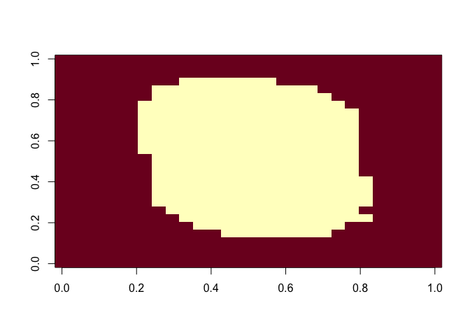
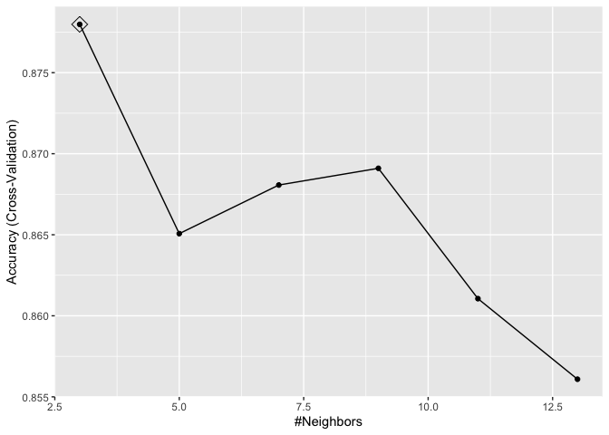
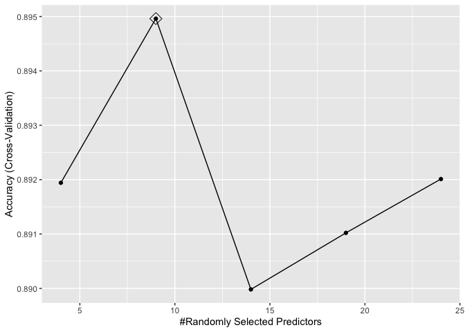
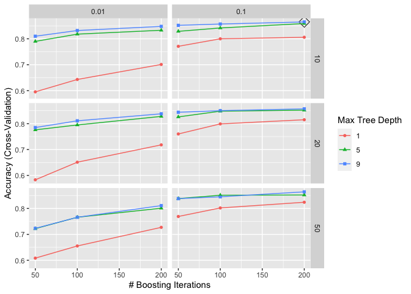
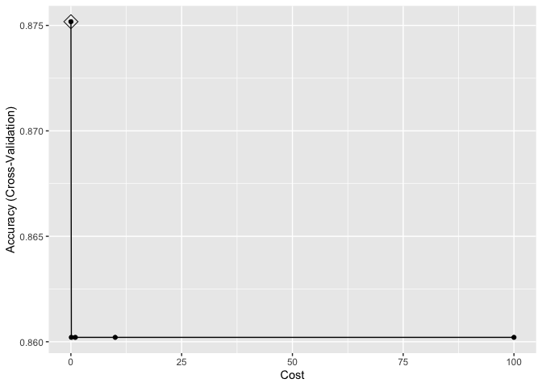
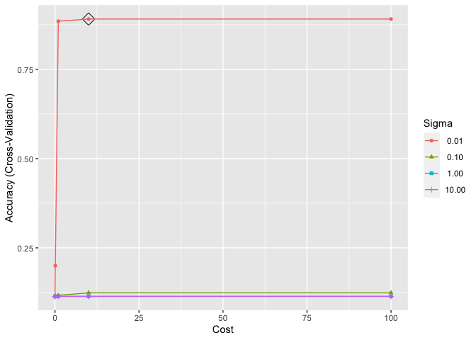

Problem Set 4
================
Nico Hawley-Weld
2/21/24

# Introduction

The MNIST dataset contains 60,000 labeled images of handwritten digits
alongside their labeled digit values. In this problem set, we train
several machine learning models on a subset of the training set. We load
and partition the dataset as follows, noting that we have sampled just
1,000 training examples instead of the recommended 10,000.

``` r
# Load and partition data
library(dslabs)
if (!exists("mnist")) mnist <- read_mnist()
set.seed(2024-2-14)
index <- sample(nrow(mnist$train$images), 1000) # set this to 1,000 instead of 10,000 for compute performance
x <- mnist$train$images[index,]
y <- factor(mnist$train$labels[index])
index <- sample(nrow(mnist$test$images), 1000)
x_test <- mnist$test$images[index,]
y_test <- factor(mnist$test$labels[index])
```

# Problem 1

Train a kNN model. Report the error rate on the test data only after you
decide on a model.

``` r
# Load packages
suppressMessages(library(caret))

# Load locally trained models if they exist
if (file.exists("trained_models.RData")) {
  load("trained_models.RData")}

# Remove and plot features with near zero variance
nzv <- nearZeroVar(x)
image(matrix(1:784 %in% nzv, 28, 28))
```



``` r
col_index <- setdiff(1:ncol(x), nzv)

# Define column names
colnames(x) <- 1:ncol(mnist$train$images)
colnames(x_test) <- colnames(x)

# Define training data frame
df <- data.frame(x[,col_index], y)

# Assess timing (0.005s)
system.time({knn3(x[, col_index], y,  k = 5)})
```

       user  system elapsed 
      0.000   0.000   0.001 

``` r
# Train knn model (2.095s or 0.035s per run for 60 runs)
if(!exists("trained_knn")) {
  system.time({trained_knn <- train(y ~ .,
                     method = "knn",
                     data = df,
                     tuneGrid = data.frame(k = seq(3, 13, 2)), # optional
                     trControl = trainControl(method = "cv", number = 10, p = .9, verbose = FALSE) # optional
)})}
ggplot(trained_knn, highlight = TRUE)
```



``` r
# Define the best fit (optional)
fitted_knn <- knn3(x[, col_index], y,  k = trained_knn$bestTune)

# Make predictions on test set and generate confusion matrix and error rate
eval_model <- function(model, name) {
  y_hat <- predict(model, data.frame(x_test[, col_index]))
  cm <- confusionMatrix(y_hat, y_test)
  paste("The ", name, " model has an error rate of: ", (1-cm$overall[["Accuracy"]])*100,"%", sep = "")
}
eval_model(trained_knn, "knn")
```

    [1] "The knn model has an error rate of: 12.1%"

# Problem 2

Train a Random Forest model. Report the error rate on the test data only
after you decide on a model.

``` r
# Load packages
suppressMessages(library(randomForest))
suppressMessages(library(ranger))

# Assess timing
system.time({randomForest(x[, col_index], y,  mtry = 9)}) # 65.726s
```

       user  system elapsed 
      5.809   0.023   5.851 

``` r
system.time({ranger(y ~ ., data = df,  mtry = 9)}) # 0.0147s
```

       user  system elapsed 
      0.841   0.008   0.137 

``` r
# Train random forest model (9.263s or 0.185s per run for 50 runs)
if(!exists("trained_ranger")) {
  system.time({trained_ranger <- train(y ~ .,
                       method = "ranger",
                       data = df,
                       tuneGrid = expand.grid(mtry = seq(4, 24, 5),
                                             splitrule = "gini",
                                             min.node.size = 1), # optional
                       trControl = trainControl(method = "cv", number = 10, p = .9, verbose = FALSE) # optional
)})}
ggplot(trained_ranger, highlight = TRUE)
```



``` r
# Define the best fit (optional)
fitted_ranger <- ranger(y ~ ., data = df, mtry = trained_ranger$bestTune$mtry,
                                      splitrule = trained_ranger$bestTune$splitrule,
                                      min.node.size = trained_ranger$bestTune$min.node.size)
fitted_rf <- randomForest(y ~ ., data = df, mtry = trained_ranger$bestTune$mtry)

# Make predictions and generate confusion matrix on test set
eval_model(trained_ranger, "ranger")
```

    [1] "The ranger model has an error rate of: 9.9%"

``` r
eval_model(fitted_rf, "rf")
```

    [1] "The rf model has an error rate of: 9.8%"

# Problem 3

Train a model of your choosing. Report the error rate on the test data
only after you decide on a model.

``` r
# Load packages
suppressMessages(library(gbm))
suppressMessages(library(kernlab))

# Assess timing (0.717s)
system.time({suppressWarnings(gbm(y ~ .,
                 data = df,
                 interaction.depth = 3,
                 n.trees = 100,
                 shrinkage = 0.1,
                 n.minobsinnode = 10)
)})
```

    Distribution not specified, assuming multinomial ...

       user  system elapsed 
      6.552   0.015   6.567 

``` r
# Train gbm model (3,545.875s or 6.56s per run for 540 runs)
if(!exists("trained_gbm")) {
system.time({trained_gbm <- train(y ~ .,
                     method = "gbm",
                     data = df,
                     tuneGrid = expand.grid(interaction.depth = c(1, 5, 9),
                                            n.trees = c(50, 100, 200),
                                            shrinkage = c(0.01, 0.1),
                                            n.minobsinnode = c(10, 20, 50)), # optional
                     trControl = trainControl(method = "cv", number = 10, p = .9, verbose = FALSE) # optional
)})}

# Train linear svm model (25.271s or 0.505s per run for 50 runs)
if(!exists("trained_svm_linear")) {
system.time({trained_svm_linear <- train(y ~ .,
                            method = "svmLinear", 
                            data = df,
                            tuneGrid = expand.grid(C = c(0.01, 0.1, 1, 10, 100)), # optional
                            trControl = trainControl(method = "cv", number = 10, p = .9, verbose = FALSE) # optional
)})}
# Train radial svm model (324.338s or 1.622s per run for 200 runs)
if(!exists("trained_svm_radial")) {
system.time({trained_svm_radial <- train(y ~ .,
                            method = "svmRadial", 
                            data = df,
                            tuneGrid = expand.grid(C = c(0.01, 0.1, 1, 10, 100),
                                                   sigma = c(0.01, 0.1, 1, 10)), # optional
                            trControl = trainControl(method = "cv", number = 10, p = .9, verbose = FALSE) # optional
)})}

# Plot parameter tunings
ggplot(trained_gbm, highlight = TRUE)
```



``` r
ggplot(trained_svm_linear, highlight = TRUE)
```



``` r
ggplot(trained_svm_radial, highlight = TRUE)
```



``` r
# Define the best fit gbm (optional)
fitted_gbm <- suppressWarnings(gbm(y ~ ., data = df, interaction.depth = trained_gbm$bestTune$interaction.depth,
                                    n.trees = trained_gbm$bestTune$n.trees,
                                    shrinkage = trained_gbm$bestTune$shrinkage,
                                    n.minobsinnode = trained_gbm$bestTune$n.minobsinnode))
```

    Distribution not specified, assuming multinomial ...

``` r
# Make predictions and generate confusion matrix on test set
eval_model(trained_gbm, "gbm")
```

    [1] "The gbm model has an error rate of: 11.5%"

``` r
eval_model(trained_svm_linear, "svm_linear")
```

    [1] "The svm_linear model has an error rate of: 11.2%"

``` r
eval_model(trained_svm_radial, "svm_radial")
```

    [1] "The svm_radial model has an error rate of: 10.6%"

# Problem 4

Build an ensemble with the three methods. Feel free to add more if you
want. Report the error rate on the test data only after you build your
ensemble.

``` r
# Generate predictions using all models
predictions_knn <- predict(trained_knn, data.frame(x_test[, col_index]), type = "prob")
predictions_rf <- predict(fitted_rf, data.frame(x_test[, col_index]), type = "prob")
predictions_gbm <- predict(trained_gbm, data.frame(x_test[, col_index]), type = "prob")
predictions_svm_linear <- predict(trained_svm_linear, data.frame(x_test[, col_index]), type = "prob") # fails
```

    Warning in method$prob(modelFit = modelFit, newdata = newdata, submodels =
    param): kernlab class probability calculations failed; returning NAs

``` r
predictions_svm_radial <- predict(trained_svm_radial, data.frame(x_test[, col_index]), type = "prob") # fails
```

    Warning in method$prob(modelFit = modelFit, newdata = newdata, submodels =
    param): kernlab class probability calculations failed; returning NAs

``` r
# Create ensemble predictions
ensemble_probabilities <- (predictions_knn + predictions_rf + predictions_gbm) / 3
y_hat <- factor(max.col(ensemble_probabilities) - 1, levels = seq(0,9))
cm <- confusionMatrix(y_hat, y_test)
paste("Error rate: ", (1-cm$overall[["Accuracy"]])*100,"%", sep = "")
```

    [1] "Error rate: 10.5%"

# Conclusion

Out of the above models, we conclude that the rf and ranger models
showed the best performance. Averaging the models that could easily be
averaged – knn, ranger, and gbm – improved performance from knn and gbm
but did not beat the original ranger. The svm models did not get enough
training data to obtain probabilities for each digit category and thus
could not be included in the average.

``` r
# Save trained models
save(trained_knn, trained_ranger, trained_gbm, trained_svm_linear, trained_svm_radial, file = "trained_models.RData")
```
