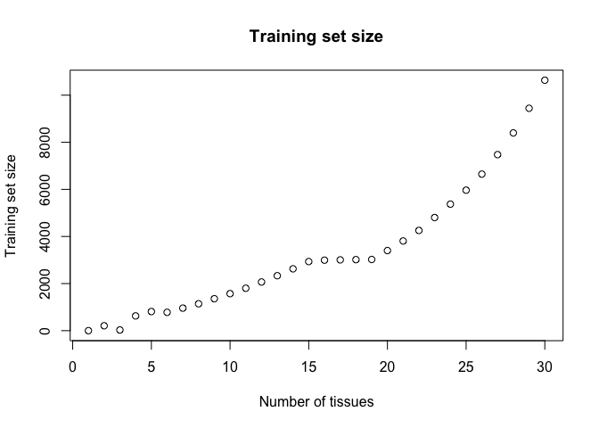
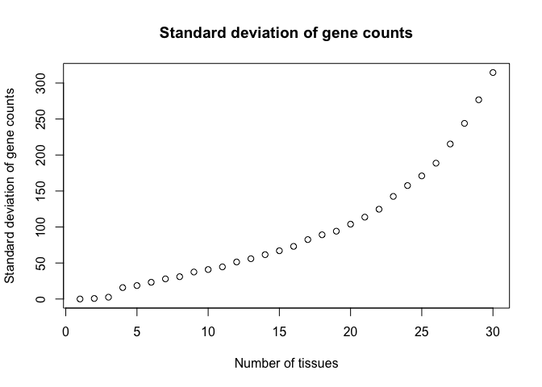

Final Project
================
Nico Hawley-Weld
3/6/24

# Final Project

Your task is to build a machine learning algorithm that can predict
tissue type from gene expression data. To do this we will use the
Genotype-Tissue Expression (GTEx) project data. These data were
collected across several centers. You will train on the data was
processed in center `B1` and will report the accuracy you obtain in the
other centers. In cases where other centers include a tissue not
represented in `B1`, you can exclude it from the testing. You can only
use `B1` to train.

We start with some data wrangling and provide some guidance. However
once the data is organized you will be on your own designing an
algorithm.

To accomplish this project you will be using all the skills you used
during the course.

## Data and metadata files

We have downloaded files from the GTEX project that include both gene
expression counts obtained from thousands of samples processed in
RNA-Seq experiments and a sample annotation file describing each sample.
Exploring the files on our Unix system we can start to understand how
the data is organized explore the data:

``` r
list.files("gtex/metadata")
```

    [1] "GTEx_Analysis_v8_Annotations_SampleAttributesDD.xlsx" 
    [2] "GTEx_Analysis_v8_Annotations_SampleAttributesDS.txt"  
    [3] "GTEx_Analysis_v8_Annotations_SubjectPhenotypesDD.xlsx"
    [4] "GTEx_Analysis_v8_Annotations_SubjectPhenotypesDS.txt" 

1.  Read the sample annotation files using the `fread` function from
    **data.table** as it is very fast. Call the object `pd` for
    phenotype data.

``` r
suppressMessages(library(data.table))
pd <- fread("gtex/metadata/GTEx_Analysis_v8_Annotations_SampleAttributesDS.txt")
```

2.  Read the annotation on subjects. Note subjects might contribute more
    than one sample:

``` r
subjects <- fread("gtex/metadata/GTEx_Analysis_v8_Annotations_SubjectPhenotypesDS.txt")
```

3.  Join subjects with sample annotation. To connect them we need to
    extract the subject ID from the sample ID in `pd`. Add a new
    variable to the `pd` data frame called `SUBJID` with the subject ID.

``` r
pd$SUBJID <- gsub("(\\w+-\\w+).*", "\\1", pd$SAMPID)
pd <- merge(pd, subjects, by = "SUBJID", all.x = TRUE)
```

4.  The expression data is stored in gct files

``` r
head(list.files("gtex/gene_read_counts_by_tissue"))
```

    [1] "gene_reads_2017-06-05_v8_adipose_subcutaneous.gct"    
    [2] "gene_reads_2017-06-05_v8_adipose_visceral_omentum.gct"
    [3] "gene_reads_2017-06-05_v8_adrenal_gland.gct"           
    [4] "gene_reads_2017-06-05_v8_artery_aorta.gct"            
    [5] "gene_reads_2017-06-05_v8_artery_coronary.gct"         
    [6] "gene_reads_2017-06-05_v8_artery_tibial.gct"           

If you look at these, say with `less`, you will notice that the first
two lines are information about the files and then it’s a tab delimited
file. We also notice that the first three columns are a row id, a gene
id, and a gene symbol.

Read the files in one by one. Because we know we will be merging them,
remove the gene id and gene symbol. We will later create a table to
match ids to genes. Read all those files in.

``` r
# We remove the gene name and gene description
fnames <- list.files("gtex/gene_read_counts_by_tissue", full.name = TRUE)
tables <- lapply(fnames, function(fn) {
  # cat("Reading file ", fn, "\n")
  x <- fread(fn, skip = 2)
  return(x[, c("Name", "Description") := NULL])
})
```

5.  Now we are going to join all those tables into one big one. We will
    make sure that the rows match by using `merge` (**data.table**’s
    join). This is overkill here because the GTEX project made sure that
    the rows were ordered the same way, but we will merge by `id` just
    to be sure. Hint: use the `Reduce` function.

``` r
# x <- do.call(cbind, tables)
x <- Reduce(function(x, y) merge(x, y, by = "id", all = TRUE), tables)
rm(fnames, tables)
```

6.  Create a data frame with just the gene information.

``` r
# x already has just the gene id and expression data
# Now we check that all columns in x have sample IDs in pd
all(colnames(x[, -1, drop = FALSE]) %in% pd$SAMPID)
```

    [1] TRUE

7.  Make sure the `pd` table is in the same order as the columns of `x`.

``` r
# We reorder the rows of pd to match columns of x and remove the 24% of phenotypic observations that don't have gene expression data
pd <- pd[match(colnames(x[, -1, drop = FALSE]), pd$SAMPID), ] 
```

8.  Now that everything is in the right order, remove the `id` from x so
    we can create a numeric matrix.

``` r
x <- x[, -1, drop = FALSE]
```

## Predict tissue type

You now have the predictors in `x` and all the sample information in
`pd`. Divide both `x` and `pd` into training and test. Build your
algorithm on the `B1` center and show your accuracy in the rest.

First we define the train and test sets, and save the datasets so they
can be reloaded.

``` r
# Define x
x_train <- as.matrix(x)[, pd$SMCENTER == "B1"]
x_test <- as.matrix(x)[, pd$SMCENTER != "B1"]

# Define y
y_train <- as.factor(pd$SMTS[pd$SMCENTER == "B1"])
y_test <- as.factor(pd$SMTS[pd$SMCENTER != "B1"])

# Save x and y
# save(x_train, x_test, y_train, y_test, file = "xy.RData")
# if (file.exists("xy.RData")) {}
#   load("xy.RData")}

# Clean up workspace
rm(x, subjects)
```

There are 30 tissue types, 56,200 genes, and 17,382 samples, 10,635 of
which are in the training set. This means that for the training set,
there are 56,200 genes across an average of 355 samples per tissue type.
For expediency we now create a minimal training and test set across a
subset of x and y, capturing just 5 tissue types instead of 30. We find
the most balanced training set.

``` r
# Pick a subset of n tissues to form a minimal, balanced training set with the lowest standard deviation between tissue type counts
subset_data <- function(n) {
  counts <- table(y_train)
  df <- data.frame(level = names(counts), count = as.numeric(counts))
  df <- df[order(df$count, decreasing = FALSE), ]
  num_levels <- length(df$level)
  combos <- matrix("", nrow = num_levels - n + 1, ncol = n)
  totals <- matrix(0, nrow = nrow(combos), ncol = ncol(combos))
  for (i in 1:(num_levels - n + 1)) {
    combos[i, ] <- df$level[i:(i + n - 1)]
    totals[i, ] <- df$count[i:(i + n - 1)]
  }
  sdevs <- apply(totals, 1, sd)
  ind <- which.min(sdevs)
  return(list(levels = combos[ind, ],
              sdev = sdevs[ind]))
}

# Plot training set size by number of tissues
training_size <- numeric(length(1:30))
sdev <- numeric(length(1:30))
for (i in 2:30) {
  output <- subset_data(i)
  training_size[i] <- length(which(y_train %in% output$levels))
  sdev[i] <- output$sdev
}
plot(training_size, xlab = "Number of tissues",
                    ylab = "Training set size",
                    main = "Training set size")
```



``` r
plot(sdev, xlab = "Number of tissues",
                    ylab = "Standard deviation of gene counts",
                    main = "Standard deviation of gene counts")
```



``` r
# Clean up workspace
rm(output, i, sdev, training_size)
```

We see choose 6 tissue types because there is a dip in training set size
compared to 5.

``` r
# Extract 6 tissues of interest
tissue_levels <- subset_data(6)$levels
print(tissue_levels)
```

    [1] "Vagina"         "Uterus"         "Ovary"          "Liver"         
    [5] "Pituitary"      "Salivary Gland"

``` r
# Create balanced sets
ind <- which(y_train %in% tissue_levels)
x_train_small <- x_train[, ind]
y_train_small <- as.factor(as.character(y_train)[ind])
ind <- which(y_test %in% tissue_levels)
x_test_small <- x_test[, ind]
y_test_small <- as.factor(as.character(y_test)[ind])

# Clean up workspace
rm(ind, subset_data, tissue_levels)
```

Having selected our minimal training and test sets, we clean up the
workspace further and take the transpose of x so that we can run the
caret package as usual.

``` r
# Transpose and rename
rm(x_test, x_train, y_test, y_train)
x <- t(x_train_small)
x_test <- t(x_test_small)
y <- y_train_small
y_test <- y_test_small
rm(x_train_small, x_test_small, y_train_small, y_test_small)

# Save and load x and y
save(x, x_test, y, y_test, pd, file = "workspace.RData")
if (file.exists("workspace.RData")) {
  load("workspace.RData")
}
```

Now we can train. First, we define gene ids (starting at 0) and remove
genes with near zero variance.

``` r
# Define row names to equal id's
colnames(x) <- 0:(ncol(x)-1)
colnames(x_test) <- 0:(ncol(x_test)-1)

# Remove genes with zero variance
suppressMessages(library(caret))
nzv <- nearZeroVar(x)
col_index <- setdiff(1:ncol(x), nzv)
rm(nzv)
```

We now run four different models wih PCA uwing parallelization. We find
that only the knn model runs without any errors. The other three report
a warning message.

``` r
# Initialize parallelization
suppressMessages(library(doParallel))
n_cores <- detectCores()
print(n_cores)
```

    [1] 8

``` r
registerDoParallel(cores = n_cores - 1)

# Define knn with PCA
knn_pca <- list(
  label = "knn_pca",
  library = c("caret"),
  type = "Classification",
  parameters = data.frame(parameter = c("dims", "k"), 
                          class = rep("numeric", 2), 
                          label = c("PCA_dimensions", "Neighbors")),
  grid = function(x, y, len = NULL, search = "grid") {
    expand.grid(dims = seq(1, ncol(x), length = len), 
                k = seq(1, 25, length = len))
  },
  fit = function(x, y, wts, param, lev, last, weights, classProbs, ...) {
    col_means <- colMeans(x)
    pca <- prcomp(sweep(x, 2, col_means), center = FALSE, rank. = param$dims)
    return(list(fit = knn3(pca$x[,1:param$dims], y, k = param$k, ...), 
                col_means = col_means,
                rotation = pca$rotation[,1:param$dims]))
  },
  predict = function(modelFit, newdata, preProc = NULL, submodels = NULL) {
    newdata <-  sweep(newdata, 2, modelFit$col_means) %*% modelFit$rotation
    return(predict(modelFit$fit, newdata, type = "class"))
  },
  prob = function(modelFit, newdata, preProc = NULL, submodels = NULL) {
     newdata <-  sweep(newdata, 2, modelFit$col_means) %*% modelFit$rotation
     return(predict(modelFit$fit, newdata))
     },
  levels = function(x) levels(x$fit$learn$y),
  sort = function(x) x[order(x$k, x$dims),]
)

# Define lda2 with PCA
lda2_pca <- list(
  label = "lda2_pca",
  library = c("caret"),
  type = "Classification",
  parameters = data.frame(parameter = c("dims", "dimen"), 
                          class = rep("numeric", 2), 
                          label = c("PCA_dimensions", "Discriminants")),
  grid = function(x, y, len = NULL, search = "grid") {
    expand.grid(dims = seq(1, ncol(x), length = len), 
                dimen = seq(1, 5, length = len))
  },
  fit = function(x, y, wts, param, lev, last, weights, classProbs, ...) {
    col_means <- colMeans(x)
    pca <- prcomp(sweep(x, 2, col_means), center = FALSE, rank. = param$dims)
    return(list(fit = lda2(pca$x[,1:param$dims], y, dimen = param$dimen, ...), 
                col_means = col_means,
                rotation = pca$rotation[,1:param$dims]))
  },
  predict = function(modelFit, newdata, preProc = NULL, submodels = NULL) {
    newdata <-  sweep(newdata, 2, modelFit$col_means) %*% modelFit$rotation
    return(predict(modelFit$fit, newdata, type = "class"))
  },
  prob = function(modelFit, newdata, preProc = NULL, submodels = NULL) {
     newdata <-  sweep(newdata, 2, modelFit$col_means) %*% modelFit$rotation
     return(predict(modelFit$fit, newdata))
     },
  levels = function(x) levels(x$fit$learn$y),
  sort = function(x) x[order(x$dimen, x$dims),]
)

# Define lda with PCA
lda_pca <- list(
  label = "lda_pca",
  library = c("caret"),
  type = "Classification",
  parameters = data.frame(parameter = c("dims"), 
                          class = rep("numeric", 1), 
                          label = c("PCA_dimensions")),
  grid = function(x, y, len = NULL, search = "grid") {
    expand.grid(dims = seq(1, ncol(x), length = len))
  },
  fit = function(x, y, wts, param, lev, last, weights, classProbs, ...) {
    col_means <- colMeans(x)
    pca <- prcomp(sweep(x, 2, col_means), center = FALSE, rank. = param$dims)
    return(list(fit = lda(pca$x[,1:param$dims], y, ...), 
                col_means = col_means,
                rotation = pca$rotation[,1:param$dims]))
  },
  predict = function(modelFit, newdata, preProc = NULL, submodels = NULL) {
    newdata <-  sweep(newdata, 2, modelFit$col_means) %*% modelFit$rotation
    return(predict(modelFit$fit, newdata, type = "class"))
  },
  prob = function(modelFit, newdata, preProc = NULL, submodels = NULL) {
     newdata <-  sweep(newdata, 2, modelFit$col_means) %*% modelFit$rotation
     return(predict(modelFit$fit, newdata))
     },
  levels = function(x) levels(x$fit$learn$y),
  sort = function(x) x[order(x$dims),]
)

# Define ranger with PCA
suppressMessages(library(ranger))
ranger_pca <- list(
  label = "ranger_pca",
  library = c("caret"),
  type = "Classification",
  parameters = data.frame(parameter = c("dims", "mtry", "splitrule", "min.node.size"), 
                          class = c("numeric", "numeric", "character", "numeric"), 
                          label = c("PCA_dimensions", "Number_of_variables_to_split", "Splitting_rule", "Min_node_size")),
  grid = function(x, y, len = NULL, search = "grid") {
    expand.grid(dims = seq(1, ncol(x), length = len), 
                mytry = seq(1, 25, length = len),
                splitrule = c("gini"),
                min.node.size = c(1))
  },
  fit = function(x, y, wts, param, lev, last, weights, classProbs, ...) {
    col_means <- colMeans(x)
    pca <- prcomp(sweep(x, 2, col_means), center = FALSE, rank. = param$dims)
    return(list(fit = knn3(pca$x[,1:param$dims], y, mtry = param$mtry, splitrule = param$splitrule, min.node.size = param$min.node.size, ...), 
                col_means = col_means,
                rotation = pca$rotation[,1:param$dims]))
  },
  predict = function(modelFit, newdata, preProc = NULL, submodels = NULL) {
    newdata <-  sweep(newdata, 2, modelFit$col_means) %*% modelFit$rotation
    return(predict(modelFit$fit, newdata, type = "class"))
  },
  prob = function(modelFit, newdata, preProc = NULL, submodels = NULL) {
     newdata <-  sweep(newdata, 2, modelFit$col_means) %*% modelFit$rotation
     return(predict(modelFit$fit, newdata))
     },
  levels = function(x) levels(x$fit$learn$y),
  sort = function(x) x[order(x$mtry, x$dims),]
)

# Train the models
control <- trainControl(method = "cv", number = 2, p = .9)
system.time(train_knn_pca <- train(x[, col_index], y, method = knn_pca, 
              tuneGrid = expand.grid(dims = c(15,30), k = c(5,7)),
              trControl = control))
```

       user  system elapsed 
    225.246   3.438  76.717 

``` r
# system.time(train_knn_lda2 <- train(x[, col_index], y, method = lda2_pca, 
#             tuneGrid = expand.grid(dims = c(15,30), dimen = c(3,5)),
#             trControl = control))
# system.time(train_knn_lda <- train(x[, col_index], y, method = lda_pca, 
#             tuneGrid = expand.grid(dims = c(15,30)),
#             trControl = control))
# system.time(train_ranger_pca <- train(x[, col_index], y, method = ranger_pca, 
#             tuneGrid = expand.grid(dims = c(15,30), mtry = c(5,7), splitrule = "gini", min.node.size = 1),
#             trControl = control))

# Fit the best knn model to all the data
col_means <- colMeans(x[, col_index])
dims <- train_knn_pca$bestTune$dims
pca <- prcomp(sweep(x[, col_index], 2, col_means), center = FALSE, rank = dims)
x_train <- pca$x[,1:dims]
fit_knn_pca <- knn3(x_train, y, k = train_knn_pca$bestTune$k)
newdata <-  sweep(x_test[, col_index], 2, col_means) %*% pca$rotation
y_hat_knn_pca <- predict(fit_knn_pca, newdata, type = "class")
cm_pca <- confusionMatrix(y_hat_knn_pca, y_test)
cm_pca$overall["Accuracy"]
```

     Accuracy 
    0.9162162 
